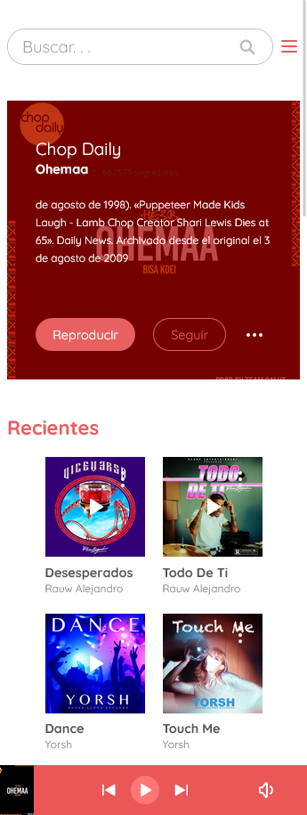
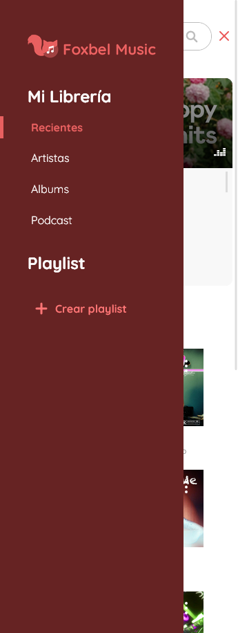
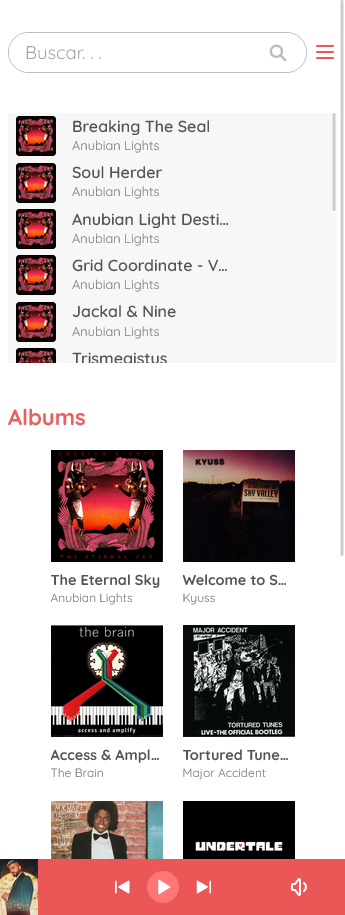
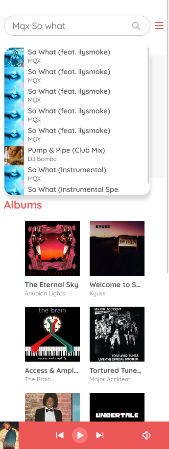
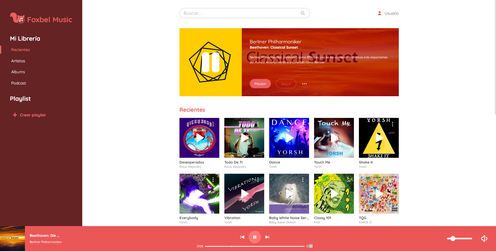
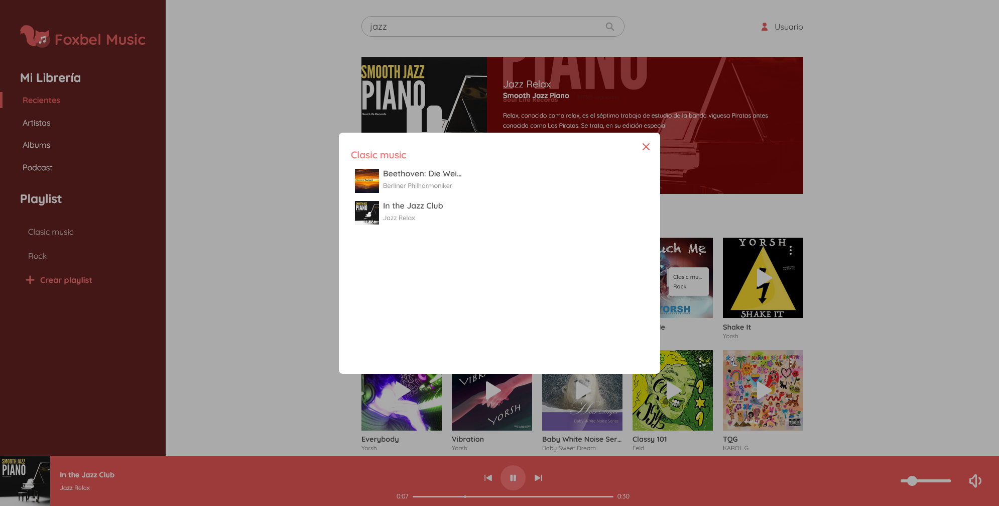
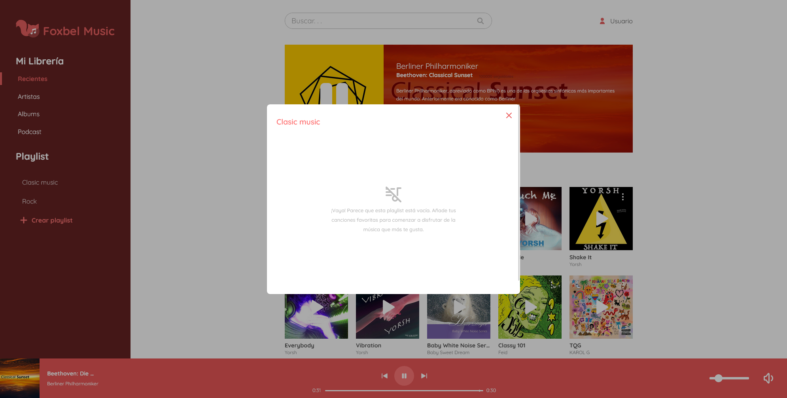

# Foxbel-music
The perfect music platform for your discerning ears: Discover Foxbel Music and immerse yourself in a world of incredible melodies! 
## Development 
### Project structure

Important Folders:
- **src:**
  - **assets**: Files also used in the application.
  - **components**: All the components are here.
  - **constants:** Constant variables to avoid hard coding.
  - **context:** Contexts are here, including useFetch which provides data to the other components that need it.
  - **enum:** Enums.
  - **helpers:** Most of the logic is here.
  - **hook:** The only custom hook.
  - **interface:** Interfaces to be more explicit.
  - **service:** Here are the API requests.
  - **styles:** All the styles used, mostly or almost all of them are .ts files.
### My experience developing
- The development process was not overly complicated, although it did require considerable effort. During this project, I had the opportunity to learn a lot about making API requests and getting better at organizing components, as I realized the importance of properly separating them. I also learned the importance of creating a solid structure for the project. Also, I found that if I'm going to make a lot of requests, it's better to have a dedicated folder to manage them efficiently.

- On the other hand, I also found that although the useState hook is useful, in some cases it is more convenient to use useReducer to handle the application state in a more robust and scalable way.

- One important thing I learned during development is that the useEffect hook does not automatically detect changes to the localStorage, since the latter is not considered a state or property of the component itself. However, I found an effective solution to this problem by creating a custom context, which can be seen in more detail in localStorageContext.tsx.

- In summary, the development of the project was not problematic, but it did involve hard work. I learned valuable lessons about making API requests, organizing components, structuring projects, and managing application state. Also, I figured out how to get around the challenge of detecting changes to the localStorage by creating a custom context.
### Technologies used in the project

1. [React](https://es.reactjs.org/) + [Typescript](https://www.typescriptlang.org/)
1. [styled-components](https://styled-components.com/)
1. [localforage](https://www.npmjs.com/package/localforage)
1. [React Router](https://reactrouter.com/en/main)
1. [Vite](https://vitejs.dev/)
1. [SDK Dezzer](https://developers.deezer.com/sdk/javascript)
1. [API Wikipedia](https://www.mediawiki.org/wiki/API:Main_page)

## Demo 

💻 You can copy the link and paste it in your browser: https://foxbel-music-web.netlify.app/

🔗 I was also able to open the website by [clicking here.](https://foxbel-music-web.netlify.app/)

## Screenshots

### Mobile

 

 

 

 

### Desktop

 

 

## Author

- Harvey Yerik
    
    - [Portfolio](https://portfolio-harvey.netlify.app/)
    - [Twitter](https://twitter.com/yerikhar)
    - [GitHub](https://github.com/YerikAH)
    - [Send Me A Message](https://yerikah.github.io/send-me-a-message/dist/)
