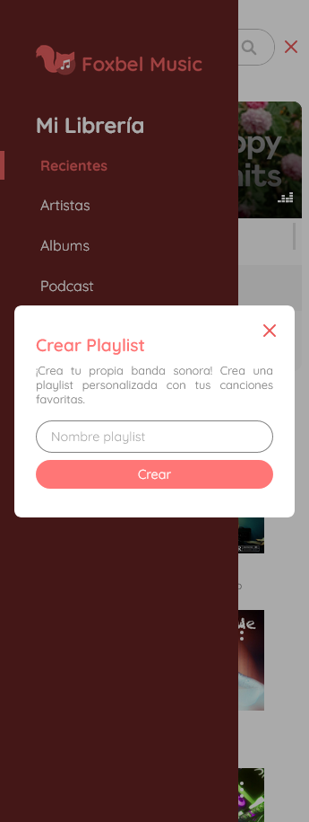

# Foxbel-music
The perfect music platform for your discerning ears: Discover Foxbel Music and immerse yourself in a world of incredible melodies! 
## Development 
### Project structure

Important Folders:
  - folder
### My experience developing
- red eye
### Technologies used in the project

1. [React](https://es.reactjs.org/) + [Typescript](https://www.typescriptlang.org/)
1. [styled-components](https://styled-components.com/)
1. [localforage](https://www.npmjs.com/package/localforage)
1. [React Router](https://reactrouter.com/en/main)
1. [Vite](https://vitejs.dev/)
1. [SDK Dezzer](https://developers.deezer.com/sdk/javascript)
1. [API Wikipedia](https://www.mediawiki.org/wiki/API:Main_page)

## Demo 

💻 You can copy the link and paste it in your browser: https://foxbel-music-web.netlify.app/

🔗 I was also able to open the website by [clicking here.](https://foxbel-music-web.netlify.app/)

## Screenshots

### Mobile

 

 

 

 

### Desktop

 

 

## Author

- Harvey Yerik
    
    - [Portfolio](https://portfolio-harvey.netlify.app/)
    - [Twitter](https://twitter.com/yerikhar)
    - [GitHub](https://github.com/YerikAH)
    - [Send Me A Message](https://yerikah.github.io/send-me-a-message/dist/)
